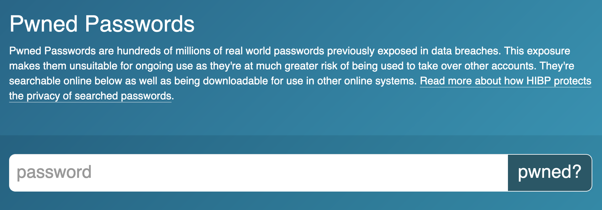

Passkey terbilang cukup baru dengan pengumuman baru tahun 2023 kemarin. Tetapi walaupun Passkey masih terbilang baru, saya pribadi sangat menganjurkan untuk menggunakannya, atau untuk pengembang sistem untuk menerapkannya.

Di tulisan ini saya akan coba memberikan beberapa alasan kenapa kita sebaiknya mulai menggunakan / menerapkan Passkey.

## Tahan terhadap _phishing_

Keunggulan utama dari Passkey adalah ketahanan terhadap *phishing* (*phishing-resistant*), dan *phishing* merupakan alasan utama dari munculnya Passkey.

Tidak jarang kita menjumpai kasus akun yang “di-*hack*.” Nah, salah satu metode untuk “nge-*hack*” akun adalah dengan *phishing*.

*Phishing* dilakukan dengan mengirimkan link yang membuat target penasaran. “Cek ini deh. Ini beneran foto kamu bukan `<link>`.” Ketika link tersebut kita klik, kita akan diminta untuk login.

Dengan kita login melalui link tadi, kita udah kena *phishing*. Kenapa? Karena situs yang meminta login tersebut adalah situs palsu yang dibikin sedemikian rupa sehingga mirip situs yang kita familiar. Kata sandi (*password*) kita sudah disadap dan direkam di sistem si “*hacker*” tepat ketika kita mencoba login di situs tersebut. Karena “*hacker*” ini punya kata sandi kita, mereka bisa login ke akun kita.

Bagaimana Passkey memberi solusi?

Passkey menggunakan _chip_ khusus yang ada di perangkat kita, ponsel, laptop, sebagai penyimpan kunci untuk login. Passkey tidak menggunakan kata sandi dalam proses login. Karena tidak menggunakan kata sandi, mekanisme *phishing* yang ada tidak akan lagi berfungsi karena tidak ada kata sandi yang bisa disadap.

## Lebih aman saat ada kebocoran data

Metode lain yang bisa dipakai untuk “nge-*hack*” akun adalah dengan menggunakan data server yang bocor. Ada kemungkinan di dalam data yang bocor tersebut ada data kata sandi (*password*) akun-akun pengguna, termasuk akun kita kalau kita punya akun di layanan tersebut.

Dan perlu kita akui bahwa tidak semua penyedia layanan digital menjunjung tinggi dan kompeten di sisi keamanan data. Kita sering mendengar berita kebocoran data, yang kadang dari layananan pemerintahan kita.

Dengan menggunakan Passkey, tidak ada kata sandi kita yang disimpan di server. Artinya jika, amit-amit, data server layanan yang kita gunakan ini bocor, hacker tidak akan mendapatkan kata sandi kita.

Perlu dicatat bahwa data kita di sebuah layanan yang datanya bocor, data kita yang ikut bocor akan tetap ada kemungkinan tersebar. Tapi dengan Passkey, akun kita di layanan lain akan jauh lebih aman dibanding kalau kita menggunakan kata sandi yang sama untuk berbagai layanan.

## Privasi yang lebih baik

Salah satu metode login yang tanpa kata sandi (*passwordless*) adalah menggunakan *single sign-on* (SSO). Biasanya kita jumpai dalam bentuk tombol dengan tulisan “Login with …” atau “Sign in with ….”

SSO membantu pengguna untuk tidak perlu membuat password baru atau menggunakan password yang sama di berbagai layanan.

Walaupun membantu, ada kekhawatiran dari sebagaian orang seputar privasi data karena dalam proses SSO beberapa data perlu diteruskan dari pihak penyedia SSO ke pihak situs / aplikasi tempat kita login.

Data-data ini bisa digunakan oleh pihak-pihak yang terkait untuk melakukan profiling dan pelacakan terhadap penggunanya.

Dengan Passkey, pertukaran data untuk login terbatas hanya antara perangkat kita dengan situs / aplikasi yang jadi tujuan kita login. Tidak perlu ada pihak ketiga yang dilibatkan dalam proses login.

## Lebih _"seamless"_ daripada 2FA / MFA

Salah satu cara untuk meningkatkan keamanan akun kita adalah dengan menambahkan faktor tambahan untuk login. Faktor tambahan ini, biasa disebut dengan 2FA - _Two Factor Authentication_ atau MFA - _Multi-factor Authentication_, biasanya memanfaatkan kode sekali pakai (OTP), bisa melalui email, SMS, atau aplikasi khusus macam Google Authenticator.

Walaupun memberi tambahan lapisan keamanan, 2FA / MFA ini relatif ribet dalam prakteknya, terutama ketika kita harus input kode secara manual dalam waktu yang terbatas.

Passkey memanfaatkan sistem keamanan perangkat kita, seperti sidik jari, wajah kita, atau PIN seperti biasanya kita membuka perangkat sebagai verifikasi ketika kita akan login sehingga terasa lebih mulus (_"seamless"_).

## _"It just works"_

Hampir semua perangkat digital modern kita sudah mendukung Passkey. Kita tidak perlu install apa-apa lagi.

Salah satu alasan kenapa Passkey itu _"it just works"_ padahal baru saja muncul adalah

- Didukung oleh vendor-vendor besar sistem operasi (OS), peramban (browser), dan perangkat: Apple, Google, Microsoft
- Protocol dan teknologi yang digunakan untuk membangun Passkey, yaitu WebAuthn, sudah diusulkan sejak 2013 dan resmi sebagai standar mulai 2019

Perangkat dan peramban yang mendukung Passkey bisa dipantau [di sini](https://www.passkeys.io/compatible-devices). Sedangkan untuk situs dan aplikasi yang menerima Passkey bisa dipantau [di sini](https://www.passkeys.io/who-supports-passkeys).

---

Passkey memberikan opsi dan solusi untuk kita, sebagai pengguna maupun sebagai pengembang sistem, untuk bisa mulai meninggalkan password.

Sebagai pengguna, apabila ada kesempatan untuk menggunakan Passkey alih-alih password di website atau aplikasi, manfaatkanlah.

Sebagai pengembang sistem, sediakanlah opsi untuk pengguna untuk bisa menggunakan Passkey karena secara teknologi lebih aman daripada password dan lebih menjaga privasi kalau dibandingkan SSO.
